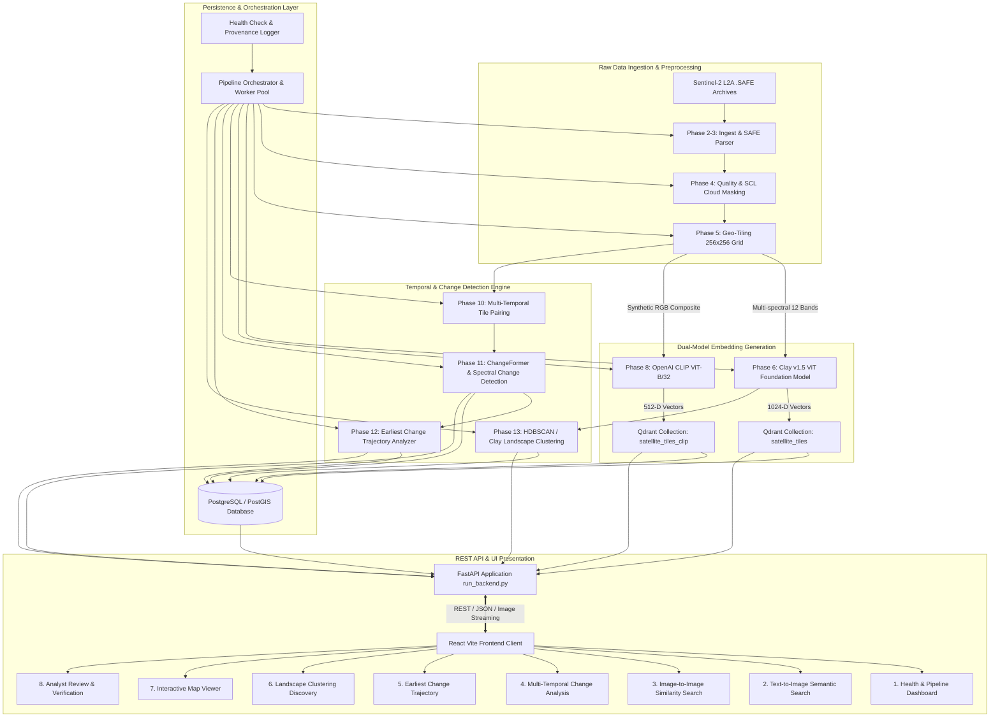

# SIH Satellite Intelligence: Comprehensive System Analysis & Architectural Specification

**Document Version:** 1.0.0  
**Project Name:** SIH Satellite Intelligence — Semantic Retrieval & Multi-Temporal Change Analysis  
**Repository Path:** `/Users/ashutoshkulkarni/Desktop/Satelite/satellite_intelligence`  
**Target Domain:** Earth Observation (EO), Geospatial Artificial Intelligence (GeoAI), Computer Vision & Foundation Models  

---

## Executive Summary

The **SIH Satellite Intelligence** system is an end-to-end GeoAI platform engineered to ingest, process, analyze, semantically query, and track multi-temporal landscape changes across Sentinel-2 satellite imagery. The platform tackles core bottlenecks in remote sensing data pipelines: large-scale multi-spectral data handling, automated cloud masking, foundation model embedding generation, high-dimensional vector similarity retrieval, deep learning change detection, spatial-temporal trajectory tracking, and human-in-the-loop analyst verification.

The platform architecture is cleanly partitioned into a high-performance **Python/FastAPI backend** (backed by Qdrant vector database, PyTorch, PostGIS/PostgreSQL, and multi-threaded background orchestration) and a **React (Vite) Single Page Application** featuring 8 dedicated operational modules.

---

## 1. High-Level System Architecture



---

## 2. Comprehensive Pipeline Phase Breakdown

The project follows a rigorous 15-phase lifecycle:

| Phase | Phase Name | Core Functionality | Primary Tech Stack | Status / Validation |
| :--- | :--- | :--- | :--- | :--- |
| **Phase 1** | Requirement & Environment Setup | Environment configuration, directory tree setup, environment variable management | Python, venv, `.env` | Complete |
| **Phase 2-3** | Ingestion & SAFE Parsing | Unpacking Sentinel-2 L2A `.SAFE` granules, XML metadata extraction, band alignment | `rasterio`, `xml.etree`, `numpy` | Complete (2022, 2023, 2024 granules) |
| **Phase 4** | Quality & Atmospheric Preprocessing | SCL (Scene Classification Layer) cloud/shadow filtering, radiometric normalization, no-data handling | `scipy`, `rasterio`, `numpy` | Complete |
| **Phase 5** | Geometric Grid Tiling | Slicing 10980x10980 scenes into 256x256 pixel georeferenced tiles with affine transform mapping | `affine`, `rasterio`, `shapely` | Complete (983 tiles per epoch) |
| **Phase 6** | Clay Foundation Embeddings | Generating 1024-dimensional multi-spectral representations via Clay v1.5 Vision Transformer | PyTorch, `claymodel`, TorchGeo | Working (115 local + Kaggle GPU ready) |
| **Phase 7** | Qdrant Clay Indexing | Storing and indexing Clay 1024-D vectors in Qdrant with Cosine distance metric and payload filters | `qdrant-client` | Complete (`satellite_tiles` collection) |
| **Phase 8-9** | CLIP Semantic Text-to-Image | Generating 512-D multimodal embeddings from RGB previews; natural language querying | `open_clip_torch`, PyTorch | Complete (`satellite_tiles_clip` collection) |
| **Phase 10** | Temporal Tile Pairing | Spatial-temporal alignment across years (2022-2023, 2023-2024, 2022-2024) | `geopandas`, `shapely`, `numpy` | Complete (543 pairs) |
| **Phase 11** | Change Detection | ChangeFormer Siamese Transformer & spectral difference (NDVI/NDBI) detection | PyTorch, `changeformer`, `opencv-python` | Complete |
| **Phase 12** | Earliest Change Detection | Multi-year temporal progression tracking to isolate precise year of change initiation | `numpy`, `pandas`, `scipy` | Complete |
| **Phase 13** | Foundation Clustering | HDBSCAN & KMeans clustering on Clay embeddings for zero-shot landscape type discovery | `scikit-learn`, `hdbscan`, `umap-learn` | Complete |
| **Phase 14** | Spatial Database Synchronization | Relational persistence in PostgreSQL/PostGIS with data provenance tracking | SQLAlchemy, GeoAlchemy2, PostgreSQL | Complete Schema & sync logic |
| **Phase 15** | Unified API & Frontend | Production FastAPI server with background orchestrator and React dashboard | FastAPI, React, Vite, Lucide | Complete & Integrated |

---

## 3. Technology Stack & Key Dependencies

### Backend Core
- **Framework:** FastAPI, Uvicorn, Pydantic v2
- **Geospatial & Image Processing:** GDAL/Rasterio, Shapely, GeoPandas, PyProj, OpenCV (`cv2`), Pillow, Scipy
- **Machine Learning & AI:**
  - **PyTorch & Torchvision:** Core deep learning runtime.
  - **Clay v1.5 (`claymodel`):** Multi-spectral Earth Observation Foundation Model (ViT) generating 1024-D embeddings.
  - **OpenCLIP (`open_clip_torch` / ViT-B/32):** Multimodal text-image embedding model generating 512-D embeddings.
  - **ChangeFormer:** Siamese transformer model for binary change mask prediction on bi-temporal pairs.
  - **Scikit-Learn, UMAP, HDBSCAN:** Unsupervised clustering and dimensionality reduction.
- **Vector & Relational Storage:**
  - **Qdrant Vector DB:** High-performance approximate nearest neighbors (HNSW index) storing isolated collections for Clay and CLIP.
  - **PostgreSQL + PostGIS:** Spatial indexing, relational entity persistence, audit logs, and analyst annotations.
  - **SQLAlchemy & GeoAlchemy2:** ORM and spatial SQL queries.

### Frontend Client
- **Framework:** React 18, Vite
- **Routing & Navigation:** React Router DOM v6
- **Icons & Visuals:** Lucide React
- **Network / HTTP:** Axios
- **Styling:** Modular CSS Design System with dark-mode responsive styling and interactive geospatial cards

---

## 4. Detailed Component Analysis

### 4.1 Ingestion, Quality Preprocessing & Tiling (`backend/app/ingestion/`, `quality/`, `tiling/`)
- **SAFE Ingestion:** Parses Sentinel-2 L2A `.SAFE` hierarchical archives, extracting bands (B02-Blue, B03-Green, B04-Red, B08-NIR, B11-SWIR1, B12-SWIR2, etc.) along with sun zenith, azimuth, and UTM coordinate reference systems (CRS EPSG:32643 / T43QFV).
- **Quality Filtering:** Employs the Scene Classification Layer (SCL) to filter clouds, cirrus, cloud shadows, and invalid zero-data pixels. Computes tile validity scores.
- **Tiling Grid:** Divides full scenes into standard 256x256 pixel tiles. Preserves sub-pixel affine transformations so every tile has exact bounding box coordinates (min_lon, min_lat, max_lon, max_lat).

### 4.2 Dual-Vector Architecture (`backend/app/embeddings/`, `semantic/`, `vector_db/`)
The system intentionally decouples general visual-semantic search from multi-spectral Earth Observation representation:
1. **Multi-Spectral Foundation Space (Clay v1.5):**
   - Input: 12-band multi-spectral satellite imagery.
   - Vector Dimension: 1024-D.
   - Purpose: Physical land cover representation, unsupervised clustering, environmental similarity.
   - Collection: `satellite_tiles`.
2. **Vision-Language Space (OpenAI CLIP):**
   - Input: Calibrated RGB preview composites.
   - Vector Dimension: 512-D.
   - Purpose: Text-to-image queries (e.g., *"industrial warehouse"*, *"dense forest"*, *"river bank"*, *"agricultural field"*) and visual search.
   - Collection: `satellite_tiles_clip`.

### 4.3 Change Detection & Temporal Trajectories (`backend/app/temporal/`)
- **Bi-Temporal Pairing:** Aligns tiles across epochs (`2022 -> 2023`, `2023 -> 2024`, `2022 -> 2024`).
- **Change Detection:** Executes ChangeFormer Siamese Transformer to generate binary change masks, supplemented by spectral index delta calculations ($\Delta\text{NDVI}$, $\Delta\text{NDBI}$, $\Delta\text{NDWI}$).
- **Earliest Change Detection:** Evaluates temporal progressions across all three years. Determines whether a change initiated in 2022-2023 or 2023-2024, quantifying change persistence, magnitude, and boundary polygons.
- **Change Classifier:** Categorizes detected changes into actionable classes: `construction`, `vegetation clearance`, `water variation`, `road development`, and `unclassified`.

### 4.4 Background Orchestration & Job Queue (`backend/app/orchestration/`)
- Multi-threaded worker pool (`PipelineOrchestrator`) allowing asynchronous execution of heavy compute phases without blocking the HTTP server.
- Automatic dependency resolution and phase completeness checks.
- System health diagnostic checks verifying disk availability, GPU/CPU status, Qdrant connectivity, and model checkpoints.

### 4.5 Data Persistence & PostGIS Relational Schema (`backend/app/database/`)
- `scenes`: Master catalogue of ingested Sentinel-2 scenes.
- `tiles`: 256x256 tiles with PostGIS geometries, cloud cover percentage, and file paths.
- `temporal_pairs`: Bi-temporal links between tile $T_1$ and tile $T_2$.
- `change_results`: Change detection outputs including binary mask paths, change area ($m^2$), and change severity.
- `earliest_changes`: Consolidated multi-year trajectory analysis records.
- `cluster_assignments`: Unsupervised cluster ID and UMAP coordinates.
- `analyst_reviews`: Human verification decisions (`confirmed` / `rejected`), assigned change taxonomy, and comments.
- `processing_history`: Complete end-to-end data provenance tracking.

---

## 5. Frontend User Interface & Workflow Modules

1. **System Health & Orchestration Dashboard (`Dashboard.jsx`):**
   - Real-time display of system health metrics, component availability, phase completeness status indicators, and active background job queues.
2. **Text-to-Image Semantic Search (`SemanticSearch.jsx`):**
   - Natural language search query interface with threshold, top-k, and year/cloud filters. Real-time preview image grid with similarity scores.
3. **Image-to-Image Similarity Search (`ImageSearch.jsx`):**
   - Tile-based visual similarity search finding identical terrain features across the tile catalog.
4. **Change Analysis Hub (`ChangeAnalysis.jsx`):**
   - Bi-temporal side-by-side comparative inspection with overlaid change detection masks and metrics.
5. **Earliest Change Tracker (`EarliestChange.jsx`):**
   - Time-series progression viewer identifying exactly when geographic modifications began.
6. **Similar Locations & Landscape Clusters (`SimilarLocations.jsx`):**
   - Clay foundation model cluster exploration revealing automated land-cover groupings.
7. **Interactive Map Viewer (`MapView.jsx`):**
   - Spatial map interface visualizing tile footprints, change hotspots, and geographical bounding boxes.
8. **Analyst Review & Verification Suite (`AnalystReview.jsx`):**
   - Dedicated workflow interface for geospatial intelligence analysts to review flagged anomalies, accept/reject change alerts, annotate change classifications, and commit audit records.

---

## 6. REST API Endpoints Overview

| Method | Endpoint | Description |
| :--- | :--- | :--- |
| `GET` | `/health` | Diagnostic status across all system services, models, and storage |
| `GET` | `/pipeline/status` | Current phase completeness and status of running tasks |
| `GET` | `/pipeline/jobs` | Detailed list of background jobs and their execution logs |
| `POST` | `/pipeline/run` | Triggers background processing for specific pipeline phases |
| `GET` | `/tiles/{tile_id}` | Returns metadata, geo-bounds, and cloud statistics for a tile |
| `GET` | `/image/{tile_id}` | Streams an RGB preview JPEG generated on-the-fly from tile bands |
| `POST` | `/search` | Executes natural language semantic query via CLIP into Qdrant |
| `POST` | `/image-search` | Executes tile-to-tile visual similarity query |
| `GET` | `/change-analysis` | Retrieves detected change events with mask paths and metrics |
| `GET` | `/earliest-change` | Retrieves multi-temporal transition trajectory results |
| `GET` | `/similar-locations` | Queries Clay clustering for landscape-matched locations |
| `POST` | `/analyst-review` | Submits validation decisions and classifications to PostGIS |

---

## 7. Current Project Status & Recommendations

### Strengths & Completed Achievements
- **Robust GeoAI Pipeline:** Complete pipeline from raw multi-spectral data ingestion to vector retrieval and change detection.
- **Dual Vector Space Separation:** Clean mathematical separation between 1024-D physical EO foundation embeddings and 512-D multimodal CLIP embeddings.
- **Production-Ready Web Application:** Modern, responsive React UI paired with a high-throughput FastAPI backend.
- **Human-in-the-Loop Integration:** Built-in analyst review mechanism with audit logging and provenance tracking.

### Operational Recommendations for Scale
1. **GPU Acceleration for Clay Foundation Model:**
   - The Clay v1.5 4.8 GB ViT model runs smoothly on GPU (CUDA/MPS). Use the provided Kaggle/Cloud GPU scripts (`clay_kaggle/`) for bulk embedding generation of thousands of tiles.
2. **PostgreSQL / PostGIS Instance Activation:**
   - The database synchronization code (`app/database/synchronization.py`) is fully built and ready to ingest existing JSON/GeoJSON outputs upon provisioning a live PostgreSQL instance.
3. **Multi-Scene Expansion:**
   - The system is architected for tile-based scaling. Additional Sentinel-2 MGRS tiles can be ingested by adding `.SAFE` granules to `backend/data/raw/`.

---

## 8. Summary of Execution Commands

### Backend Server
```bash
cd backend
source .venv/bin/activate    # On Windows: .venv\Scripts\activate
python run_backend.py
```
*API will run on `http://localhost:8000` (Swagger UI at `http://localhost:8000/docs`).*

### Frontend Dashboard
```bash
cd frontend
npm install
npm run dev
```
*Dashboard will run on `http://localhost:5173` or `http://localhost:3000`.*
