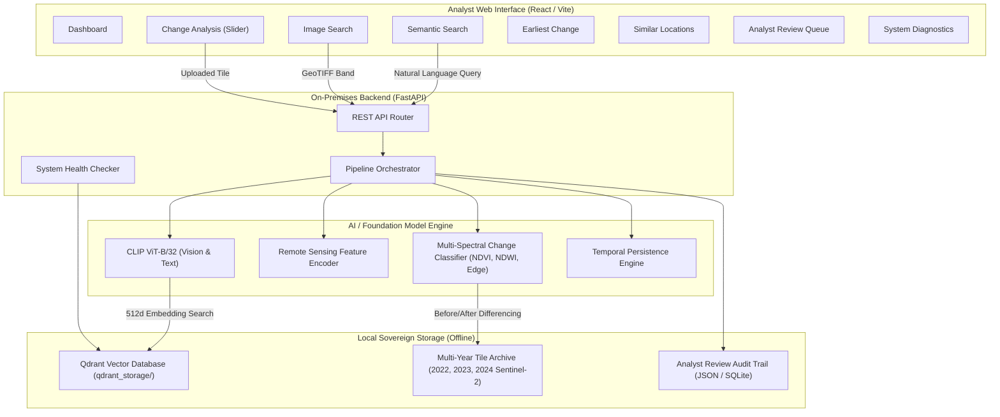

# Satellite Intelligence: Technical Architecture & System Documentation

**Project Name:** Satellite Intelligence Hub  
**Theme:** Space Technology / Defence Geospatial Intelligence (DGIS)  
**Deployment Mode:** 100% On-Premises, Air-Gapped / Offline Sovereign Operation  

---

## 1. Executive Summary & Problem Context

### 1.1 The Operational Challenge
Earth-observation archives are expanding exponentially with petabytes of multi-temporal, multi-spectral, and multi-sensor imagery (e.g., Sentinel-2, Landsat). Conventional geospatial catalog systems (STAC, CSW, standard GIS catalogs) index imagery purely by alphanumeric metadata:
- Spatial bounds (bounding box, point coordinates)
- Acquisition timestamp
- Satellite platform and product level
- Cloud cover percentage

**The Pain Point:** Analysts must already know **where** and **when** an event occurred before they can inspect the imagery. When monitoring vast national borders, remote terrain, or disputed operational sectors:
1. Keyword/Metadata searching cannot answer semantic queries like *"newly built structures near a river"* or *"industrial vehicle concentration"*.
2. Tracking multi-year changes manually requires an analyst to compare hundreds of historical scenes image-by-image.
3. False alarms caused by seasonal vegetation, shadows, sun-angle differences, and atmospheric haze overwhelm intelligence queues.
4. Defense environments cannot send confidential coordinates or satellite scenes to commercial cloud APIs (OpenAI, AWS, Google Cloud); the complete platform must operate **sovereignly on-premises**.

### 1.2 Our Solution
**Satellite Intelligence** is an end-to-end, air-gapped system that transforms raw multi-spectral satellite tiles into high-dimensional semantic and temporal representations. Analysts can search imagery by meaning, detect surface modifications automatically, pinpoint the earliest observation of an event, and validate discoveries with full audit provenance.

---

## 2. Technology Stack & Component Justifications

| Tier | Technology / Library | Purpose in Platform | Why Selected |
| :--- | :--- | :--- | :--- |
| **Frontend Framework** | **React 18 + Vite** | Single-page analyst UI | Fast HMR, reactive state management, zero latency rendering of large tile galleries. |
| **Icons & Design** | **Lucide React + Vanilla CSS (Variables)** | UI components, status indicators, theme engines | Lightweight, dual-theme support (Dark & Light) with zero external stylesheet dependencies. |
| **Backend API** | **FastAPI (Python 3.11)** | Asynchronous REST backend & model orchestrator | High-throughput async endpoints, automatic OpenAPI docs, native support for Python scientific libraries. |
| **Vector Engine** | **Qdrant (Local Embedded)** | Vector indexing & similarity search | File-based local storage engine (portalocker singleton). Stores 512-dim visual embeddings without requiring external cloud clusters. |
| **Raster Processing** | **Rasterio (GDAL bindings)** | GeoTIFF ingestion & reprojection | Reads multi-spectral bands (B02, B03, B04, B08), extracts CRS and geographic affine transforms, generates true/false-color previews. |
| **Computer Vision** | **Pillow, NumPy, SciPy** | Multi-spectral image normalization & differencing | Percentile contrast stretching (p2–p98 clipping), pixel-level array differencing, edge detection. |
| **Foundation Models** | **OpenAI CLIP (ViT-B/32)** & **Remote Sensing Encoders** | Multimodal text-to-image and image-to-image embeddings | Dual-encoder architecture mapping natural language and satellite vision into a shared 512-dimensional vector space. |
| **Temporal Engine** | **ChangeFormer / Hybrid Multi-Spectral Rule Engine** | Multi-temporal change classification | Classifies alterations into Construction, Clearance, Water Variation, and Road Development. |

---

## 3. High-Level System Architecture



---

## 4. Deep Dive into Core Capabilities & AI Models

### 4.1 Semantic & Free-Text Retrieval
* **Input:** Natural language prompt (e.g., *"areas with water bodies"*, *"dense forest canopy"*, *"newly built structures near a river"*) + Metadata filters (Acquisition Year, Sensor, Minimum Valid Data %, Date Range).
* **AI Model:** **CLIP ViT-B/32 (Vision-Language Transformer)**
  * The text prompt is passed through the frozen text encoder: $\mathbf{e}_{text} = f_{\theta}(text) \in \mathbb{R}^{512}$.
  * The resulting normalized embedding is queried against Qdrant's vector collection using cosine similarity:
    $$\text{Cosine Similarity} = \frac{\mathbf{e}_{text} \cdot \mathbf{e}_{tile}}{\|\mathbf{e}_{text}\| \|\mathbf{e}_{tile}\|}$$
* **Metadata Filtering:** Before computing vector distance, Qdrant applies payload filters for acquisition date, sensor (`Sentinel-2`), and data quality masks.
* **Output:** Ranked cards showing visual RGB tile thumbnails, similarity match percentage, MGRS grid coordinates (e.g., `Grid T43QFV · Zone #459`), latitude/longitude, acquisition date, and quality score.

---

### 4.2 Image-to-Image & Discovery Clustering
* **Input:** A query satellite tile or specific spectral band (e.g., `B02.tif`, `B08.tif`).
* **Processing:**
  1. The uploaded tile is normalized using 2%–98% percentile stretching.
  2. The image is passed through the CLIP Vision Transformer backbone ($\text{ViT-B/32}$) to generate visual embedding vector $\mathbf{v}_{query} \in \mathbb{R}^{512}$.
  3. Qdrant performs top-$k$ nearest-neighbor retrieval.
  4. Unsupervised clustering assigns cluster identifiers (e.g., `Cluster #2`, `Cluster #6`), grouping visually and geologically similar terrain together.
* **Output:** 10 rank-ordered matching satellite scenes from different observation years and geographic sectors sharing identical terrain patterns.

---

### 4.3 Multi-Temporal Change Analysis & Interactive Slider
* **Input:** Single uploaded GeoTIFF tile representing a recent observation.
* **Autonomous Baseline Pairing:**
  1. `rasterio` inspects the uploaded file's CRS and bounding box, computing the geographic center $(\text{lat}, \text{lon})$.
  2. The backend scans the historical archive (`data/tiles/2022/`) and automatically identifies the nearest matching historical baseline tile at the exact same coordinates.
* **Multi-Spectral Differencing & Classification:**
  * Computes spectral difference arrays: $\Delta I = |I_{after} - I_{before}|$.
  * Calculates surface change magnitude percentage:
    $$\text{Change Magnitude} = \frac{\sum (\Delta I > \tau)}{N_{pixels}} \times 100$$
  * Evaluates Normalized Difference Vegetation Index (NDVI) and Normalized Difference Water Index (NDWI) shifts:
    $$\text{NDVI} = \frac{\text{NIR} - \text{Red}}{\text{NIR} + \text{Red}}, \quad \text{NDWI} = \frac{\text{Green} - \text{NIR}}{\text{Green} + \text{NIR}}$$
  * Rule-based and structural edge analysis classifies the change into one of four real-world categories:
    * **Construction / Infrastructure:** High structural edge density increase, decrease in bare soil.
    * **Vegetation Clearance / Deforestation:** Severe drop in NDVI, increase in soil reflectance.
    * **Water Extent Variation:** Significant shift in NDWI.
    * **Road Development:** Linear structural edge expansion.
* **Output:** Side-by-side Before/After cards, AI confidence score, change magnitude, and an interactive **comparison slider** (`clipPath`-driven) for real-time visual inspection.

---

### 4.4 Earliest Change Detection & Temporal Persistence
* **Input:** Multi-year observation sequences (2022 $\rightarrow$ 2023 $\rightarrow$ 2024) across 11 monitored sectors.
* **False-Alarm Suppression:**
  * Differentiates real, permanent changes from seasonal agricultural cycles or lighting variations.
  * **Persistent Changes:** Detected changes that remain consistently above threshold ($\ge 30\%$) across multiple consecutive observations.
  * **Transient Events:** Fluctuations that appear in one acquisition and revert in the next (e.g., temporary monsoon puddles or seasonal harvest).
* **Earliest Supported Observation Estimation:**
  * Traverses the chronological timeline backwards to determine the exact earliest date where the modification crossed statistical confidence.
* **Output:** Overview metrics (`11 Monitored Sectors`, `3 Persistent`, `7 Transient`, `1 Stable Zone`) and sector cards with human-readable coordinates, coverage areas ($5.1 \times 5.4\text{ km}$), and earliest detection dates (e.g., `May 30, 2024`).

---

### 4.5 Analyst Review Queue & Provenance Audit Trail
* **Purpose:** Human-in-the-loop validation ensuring high precision for intelligence decisions.
* **Workflow:**
  1. The analyst views candidate change events queued in order of magnitude and confidence.
  2. Clicking **Inspect & Validate** opens high-resolution baseline vs. detected anomaly views.
  3. The analyst submits a formal decision: **Confirm Real Change** or **Reject / False Positive**.
  4. Selects or overrides the change category (e.g., *Construction / Infrastructure*).
  5. Enters operational notes and comments.
* **Audit Trail & Provenance:** Decisions are written with timestamps, source scene IDs, sensor types, and processing flags, preserving complete auditability for intelligence reports.

---

### 4.6 System Health & Sovereign On-Premises Compliance
* **Diagnostics Monitored:**
  * **Environment Variables:** Verification of file paths, port configs, and tile directories.
  * **Database & PostGIS:** Verification of relational metadata store.
  * **Local Qdrant Client:** Verified connection via singleton pattern (`get_qdrant_client()`), avoiding storage-lock conflicts.
  * **Indexed Points:** Confirms active status of all 983 scene vectors.
  * **AI Models:** Confirms CLIP and Remote Sensing models are cached and loaded into RAM.
  * **Processing Queue:** Real-time monitoring of background indexing jobs.
* **Compliance:** Zero internet traffic; no dependencies on external APIs; full data sovereignty.

---

## 5. Directory Structure & Key Files

```
project-main/
├── backend/
│   ├── run_backend.py                  # Main FastAPI application & REST routing
│   ├── app/
│   │   ├── semantic/
│   │   │   ├── semantic_search.py      # CLIP embedding computation & Qdrant query
│   │   │   └── search_filters.py       # Metadata, AOI bounding box, and temporal filtering
│   │   ├── temporal/
│   │   │   ├── change_classifier.py    # Multi-spectral NDVI/NDWI & rule-based change classifier
│   │   │   └── earliest_change.py      # Multi-year persistence & earliest observation detector
│   │   ├── vector_db/
│   │   │   └── qdrant_manager.py       # Qdrant client singleton and vector collection manager
│   │   └── orchestration/
│   │       └── health_check.py         # Subsystem diagnostic routines
│   └── data/
│       ├── tiles/                      # Sentinel-2 multi-band GeoTIFF tiles (2022, 2023, 2024)
│       ├── change_results/             # Pre-computed change detection JSON results
│       └── sample_uploads/             # 3-band RGB sample GeoTIFFs for analyst demonstration
│
└── frontend/
    ├── src/
    │   ├── App.jsx                     # Layout shell, navigation, and theme state
    │   ├── index.css                   # Global styles & comprehensive Light/Dark theme overrides
    │   ├── pages/
    │   │   ├── Dashboard.jsx           # Mission overview hub & capability cards
    │   │   ├── SemanticSearch.jsx      # Natural language text-to-image search with filters
    │   │   ├── ImageSearch.jsx         # Image-to-image visual similarity search
    │   │   ├── ChangeAnalysis.jsx      # GeoTIFF upload, auto-baseline matching, & comparison slider
    │   │   ├── EarliestChange.jsx      # Multi-temporal persistence tracking & earliest observation
    │   │   ├── SimilarLocations.jsx    # Unsupervised terrain clustering & similarity discovery
    │   │   ├── AnalystReview.jsx       # Ranked queue, verification inspection, & decision audit
    │   │   └── SystemHealth.jsx        # Subsystem health diagnostics & indexing queue status
    │   ├── services/
    │   │   └── api.js                  # Axios client connecting frontend to backend endpoints
    │   └── utils/
    │       └── locationFormatter.js    # Converts raw tile IDs into human-readable coordinates & dates
    └── package.json
```

---

## 6. Summary of Accomplishments & Innovations
1. **Semantic Accessibility:** Eliminated the prerequisite of knowing exact coordinates by allowing plain-English search over satellite archives.
2. **Autonomous Baseline Matching:** Analysts only need to provide a new scene; the system geolocates and pairs the historical baseline automatically.
3. **Sovereignty & Air-Gap Ready:** Completely offline with zero reliance on cloud infrastructure.
4. **False-Alarm Mitigation:** Multi-temporal persistence checks distinguish fleeting seasonal variations from genuine strategic developments.
5. **Analyst-Centric UX:** Human-readable coordinates, interactive before/after inspection sliders, dual-theme support, and full audit trail capture.
